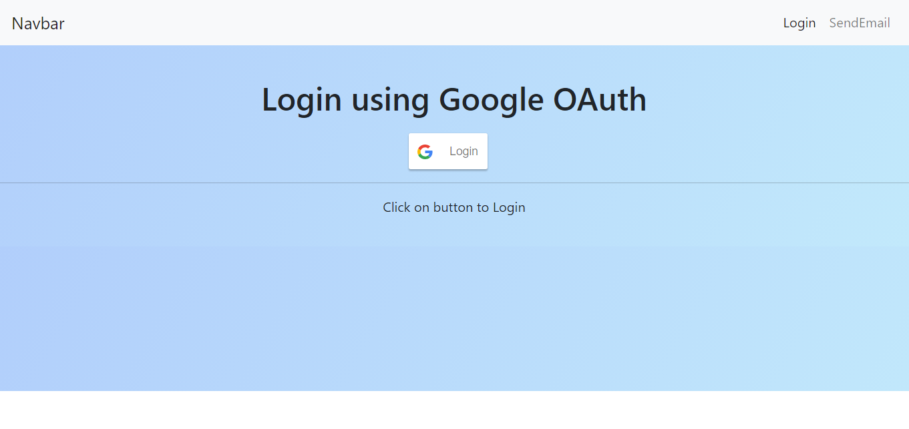
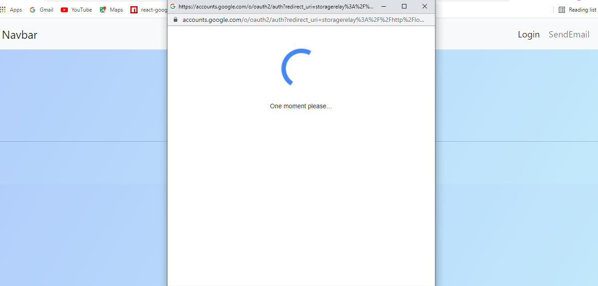
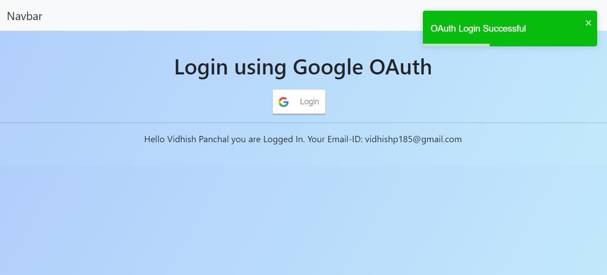
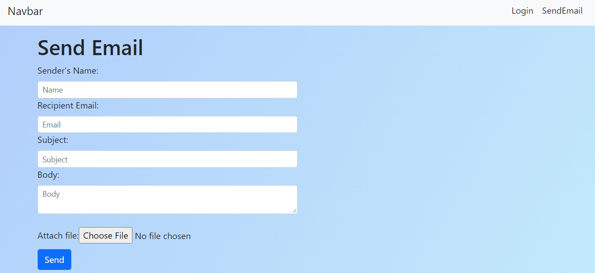
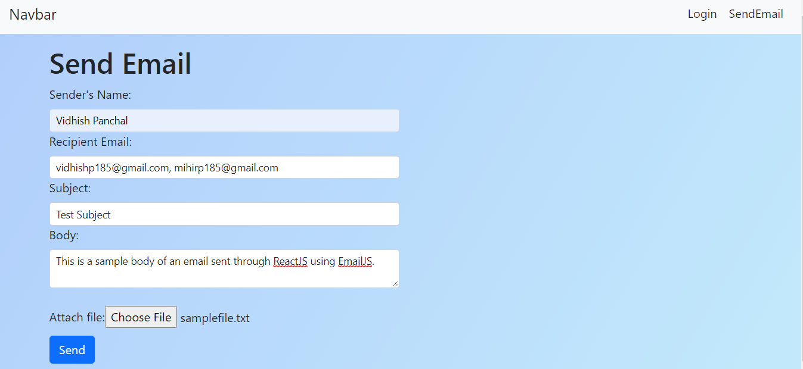
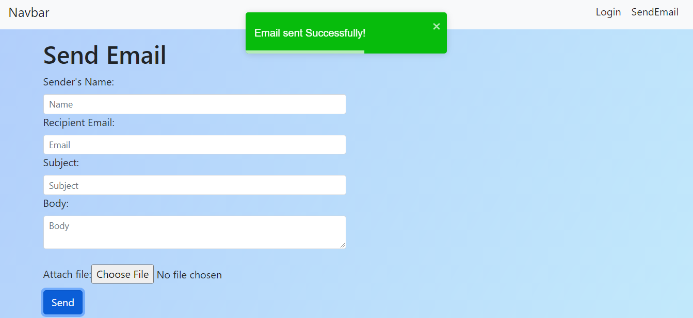
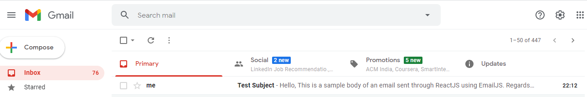
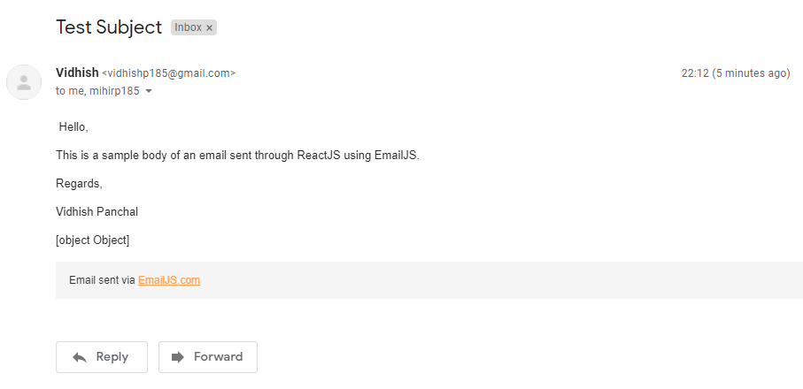
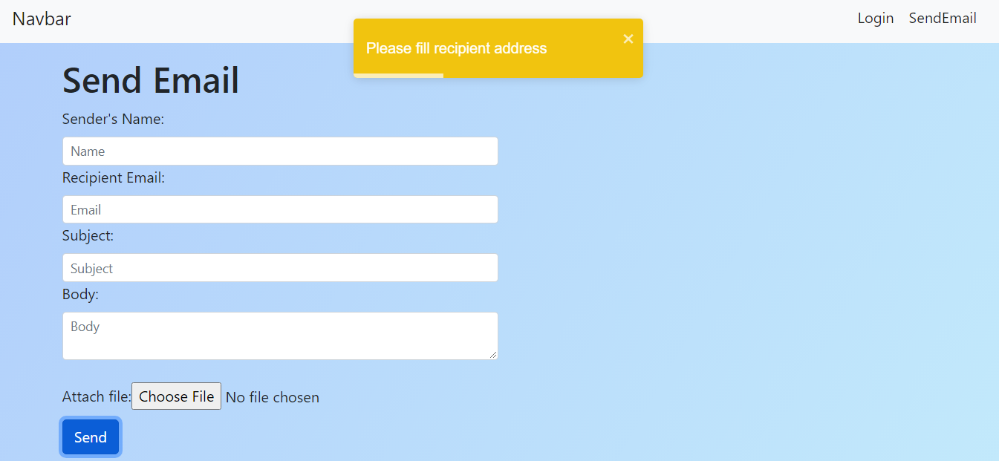

This project has been made using ReactJS and has OAuth authentication using react-google-login. And a user can send emails consisting of a Subject and body (email template made on EmailJS) to multiple recipients and also add attachments. Toast-Notifications have been added to improve the user experience.

<h3>Login Page</h3>

 
Once the button is clicked, Google OAuth initializes.

 
Once the user is Logged In using OAuth, dynamic data of user's google account such as Name and Email-ID can be seen
<h3>User Logged In</h3>

 
Users can also send emails directly from the frontend built using ReactJS. These emails are sent using EmailJS. 
<h3>Email Page</h3>

 
Emails can be sent to multiple users by the separating multiple Email-IDs using commas(,).

 
Once the send button is Clicked, email will be sent to the respective recipients and the user will be notified that the email has been sent successfully using a Toast Notification.
<h1>Email sent successfully</h1>

 
The recipients will be able to view the emails.

If there are any errors that prevent the user from sending emails, the user will be notified.

